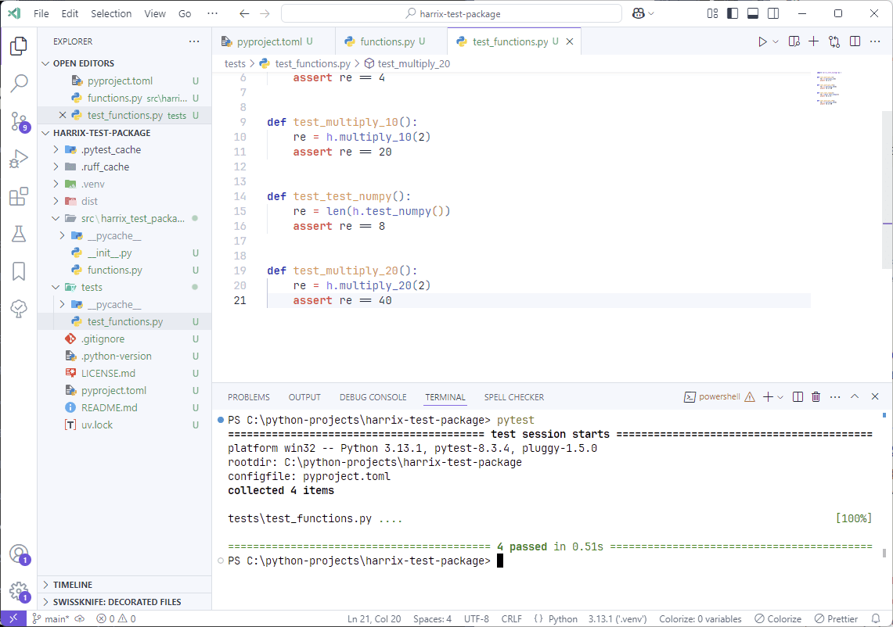

# Creating packages in Python with uv


Detailed guide on creating your own Python package using uv, exemplified on Windows 11.

<details>
<summary>📖 Contents</summary>

- [Preparation](#preparation)
- [Creating a Project](#creating-a-project)
- [Installing Packages](#installing-packages)
- [Creating a Package](#creating-a-package)
- [Package Testing](#package-testing)
- [Building and Publishing the Package on PyPi](#building-and-publishing-the-package-on-pypi)
- [Using the Package Published on PyPi](#using-the-package-published-on-pypi)
- [Using the Package Published on PyPi with pip](#using-the-package-published-on-pypi-with-pip)
- [Publishing a New Version of the Package](#publishing-a-new-version-of-the-package)
- [Deploying Package Development on a New Machine](#deploying-package-development-on-a-new-machine)
- [Installing a Local Package](#installing-a-local-package)

The package created within this article:

- <https://github.com/Harrix/harrix-test-package>
- <https://pypi.org/project/harrix-test-package>

Official documentation:

- [uv](https://docs.astral.sh/uv/) — the tool's website.
- <https://packaging.python.org/tutorials/packaging-projects>
- <https://github.com/pypa/sampleproject>

I will demonstrate using VSCode, but you can use another editor and terminal.

</details>

## Preparation

Install and configure uv, for example, using the article [Installing and Working with uv (Python) in VSCode](https://github.com/Harrix/harrix.dev-articles-2025-en/blob/main/uv-vscode-python/uv-vscode-python.md) | [🡥](https://harrix.dev/en/articles/2025/uv-vscode-python/).

## Creating a Project

My project will be called `harrix-test-package` (but will be imported as `harrix_test_package`). Choose your own name for your project. Use hyphens between words in the project name, not spaces or underscores.

Open the project folder in VSCode via `File` → `Open Folder...`, for example, `C:\python-projects`, open the terminal there with `Ctrl` + `` ` `` and create a uv project using the command (of course, you will have a different project name):

```shell
uv init --package harrix-test-package
```

Now open the created folder `C:\python-projects\harrix-test-package` in VSCode, open the terminal again with `Ctrl` + `` ` ``:


_Figure 1: Created empty project_

Note that the project structure is more complex than it would be when calling the `uv init harrix-test-package` command, as there are more requirements for the package.

Create a virtual environment for your project. My virtual environment will be in the `.venv` folder located in the project folder:

```python
uv sync
```


_Figure 2: Calling uv sync_

## Installing Packages

To test the integration of external packages into our library, we will install two popular packages `numpy` and `isort`. The second package will be installed in `--dev` mode, as it is needed for library development but not for the end-user. We will also install the `pytest` library for library testing and `ruff` for code formatting and checking.

```python
uv add numpy
uv add --dev isort
uv add --dev ruff
uv add --dev pytest
```

Information about the installed libraries will be located in the files:

- `pyproject.toml`
- `uv.lock`


_Figure 3: Installed libraries_

## Creating a Package

We will have a simple package with three functions:

```python
import numpy as np

def multiply_2(x):
    return x * 2


def multiply_10(x):
    return x * 10


def test_numpy():
    return np.arange(-2, 2, 0.5)
```

To do this, create a file `functions.py` (yours will be named differently) in the folder `src\harrix_test_package` and place the above code:


_Figure 4: File functions.py_

Note that inside the `src` folder is the package name in the form I will import it into other projects. Hyphens cannot be used in this name according to Python syntax rules. Therefore, the folder is named `harrix_test_package` (without hyphens), not `harrix-test-package`.

The file `src\harrix_test_package\__init__.py` imports everything that is in our package for users:

```python
from .functions import *
```

We will test our package using [pytest](https://docs.pytest.org/en/stable/) (it is used by default in uv). This is why we installed it above with `uv add --dev pytest`:

For the tests, create a `tests` folder with test files. Don't forget that the test file name should start with `test_`

File `tests\test_functions.py`:

```python
import harrix_test_package as h


def test_multiply_2():
    re = h.multiply_2(2)
    assert re == 4


def test_multiply_10():
    re = h.multiply_10(2)
    assert re == 20


def test_test_numpy():
    re = len(h.test_numpy())
    assert re == 8
```


_Figure 5: File with function tests_

Now let's look at the project configuration files.

File `pyproject.toml` with changes made:

```toml
[project]
name = "harrix-test-package"
version = "0.7"
description = "Test package"
readme = "README.md"
authors = [{ name = "Anton Sergienko", email = "anton.b.sergienko@gmail.com" }]
requires-python = ">=3.13"
dependencies = ["numpy>=2.2.1"]
license = { file = "LICENSE.md" }

[project.urls]
Homepage = "https://github.com/Harrix/harrix-test-package"

[project.scripts]
harrix-test-package = "harrix_test_package:main"

[build-system]
requires = ["hatchling"]
build-backend = "hatchling.build"

[dependency-groups]
dev = ["isort>=5.13.2", "pytest>=8.3.4", "ruff>=0.8.6"]

[tool.ruff]
line-length = 120
```

My package version is `0.7`, as this package has already been used for packaging experiments with other Python tools. Yours will likely be `0.1`, `0.0.1`, or `1.0` — it all depends on the versioning system you have chosen for your packages.

Change the `name`, `description`, `Homepage`, and `authors` parameters to your own. The `project.urls` section was added manually, so if you don't have a project page, you can delete it. Similarly for the line `license = {file = "LICENSE.md"}`.

For formatting code into 120 characters via ruff, the following settings have been inserted:

```toml
[tool.ruff]
line-length = 120
```

I also left the default minimum Python version for the example, and this is the latest Python version: `requires-python = ">=3.13"`, but you may want your package to be more universal and lower the version.


_Figure 6: File pyproject.toml_

Create a license file `LICENSE.md`, which contains the text of your license. I have an [MIT license](https://en.wikipedia.org/wiki/MIT_License). Replace the `[Year] [Your name]` block with your own:

```markdown
# The MIT License

Copyright © [Year] [Your name]

Permission is hereby granted, free of charge, to any person obtaining a copy of this software and associated documentation files (the "Software"), to deal in the Software without restriction, including without limitation the rights to use, copy, modify, merge, publish, distribute, sublicense, and/or sell copies of the Software, and to permit persons to whom the Software is furnished to do so, subject to the following conditions:

The above copyright notice and this permission notice shall be included in all copies or substantial portions of the Software.

THE SOFTWARE IS PROVIDED "AS IS", WITHOUT WARRANTY OF ANY KIND, EXPRESS OR IMPLIED, INCLUDING BUT NOT LIMITED TO THE WARRANTIES OF MERCHANTABILITY, FITNESS FOR A PARTICULAR PURPOSE AND NONINFRINGEMENT. IN NO EVENT SHALL THE AUTHORS OR COPYRIGHT HOLDERS BE LIABLE FOR ANY CLAIM, DAMAGES OR OTHER LIABILITY, WHETHER IN AN ACTION OF CONTRACT, TORT OR OTHERWISE, ARISING FROM, OUT OF OR IN CONNECTION WITH THE SOFTWARE OR THE USE OR OTHER DEALINGS IN THE SOFTWARE.
```


_Figure 7: File LICENSE_

The `README.md` file contains the description of your package in [Markdown](https://en.wikipedia.org/wiki/Markdown) format. It can be anything. Here is mine:

````markdown
# harrix-test-package

Test package.

## Install

```shell
pip install harrix-test-package
```

```shell
uv add harrix-test-package
```

## Using

```python
import harrix_test_package as h

print(h.multiply_2(2))
```
````


_Figure 8: File README.md_

## Package Testing

We have already created a `tests` folder with a test file and installed `pytest` (if not, install it via `uv add --dev pytest`). So, to test the package, you just need to run the command in the terminal:

```shell
pytest
```


_Figure 9: Package Testing Result_

Installing our package in developer mode, like in pip, is not necessary.

If you see an error of this kind, a simple computer restart helped me:


_Figure 10: alt text_

## Building and Publishing the Package on PyPi

Register on [PyPi](https://pypi.org/account/register/). You will also need to [set up two-factor authentication](https://pypi.org/manage/account/two-factor/). I used Microsoft Authenticator for this.

Build the package for publication and publish it:

```shell
uv build
```


_Figure 11: Package Build Process_

Send the package to the test server:

```python
uv publish --token pypi-Qwerty1234567890QwertyQwerty1234567890Qwerty1234567890Qwerty1234567890Qwerty1234567890Qwerty1234567890Qwerty1234567890Qwerty1234567890Qwerty1234567890Qwerty1234567890Qwerty12
```

You need your own token, the one shown above will not work, of course.

This token can be generated on the page <https://pypi.org/manage/account/token/>. If you are asked for some authentication code, you have two-factor authentication set up, and you need to get this code in your configured way. For me, it's Microsoft Authenticator. So, after passing the code stage, create the token:


_Figure 12: Token Creation_


_Figure 13: Created Token_

Copy and paste it into the command shown above in VSCode, press `Enter`, and the process starts.


_Figure 14: Package Publication_

Now you can view the published package at the link <https://pypi.org/project/harrix-test-package/0.7/>:


_Figure 15: Published Package_

Sometimes, if you forget to change the package version, build it, fix the version, rebuild the package, and send it to the server, you get an error saying the package already exists. You need to delete the `dist` folder, rebuild the fixed version, and send it again:


_Figure 16: dist Folder_

## Using the Package Published on PyPi

To check the published package, create a new Python project using uv (for example, named `test`) with its virtual environment, where you will install the published package. You can do it the [usual way](https://github.com/Harrix/harrix.dev-articles-2025-en/blob/main/uv-vscode-python/uv-vscode-python.md) | [🡥](https://harrix.dev/en/articles/2025/uv-vscode-python.md/), or through the console with the project opened in VSCode. Here is the code for Windows using PowerShell:

```shell
cd C:\python-projects
uv init test
cd test
uv sync
uv add harrix-test-package
code C:\python-projects\test
```


_Figure 17: Executing Commands in Terminal_

Since I use Visual Studio Code Insiders, my last line looks like `code-insiders C:\python-projects\test`

In the file `src\main.py`, add the following code example:

```python
import harrix_test_package as h

print(h.multiply_2(2))

print(h.multiply_10(2))

print(len(h.test_numpy()))
```

Run the code:


_Figure 18: Using the Package_

## Using the Package Published on PyPi with pip

The created package is universal. It can be used not only in projects with uv. Let's create an empty project in PyCharm with standard `venv`.

In the terminal, type `pip install harrix-test-package`:


_Figure 19: Installing the Package in PyCharm_

Write the code using the library and run it. Everything works:


_Figure 20: Running Code Using the Package_

## Publishing a New Version of the Package

Let's try adding a new function to the package and publishing a new version. So, here's a mega useful function:

```python
def multiply_20(x):
    return x * 20
```

After adding, the file `src\harrix_test_package\functions.py` will look like this:

```python
import numpy as np

def multiply_2(x):
    return x * 2

def multiply_10(x):
    return x * 10

def test_numpy():
    return np.arange(-2, 2, 0.5)

def multiply_20(x):
    return x * 20
```

Also, add a new test to the file `tests\test_functions.py`:

```python
import harrix_test_package as h

def test_multiply_2():
    re = h.multiply_2(2)
    assert re == 4

def test_multiply_10():
    re = h.multiply_10(2)
    assert re == 20

def test_test_numpy():
    re = len(h.test_numpy())
    assert re == 8

def test_multiply_20():
    re = h.multiply_20(2)
    assert re == 40
```

Now, run the tests:

```shell
pytest
```

Tests passed successfully:



_Figure 21: Package Testing_

In the file `pyproject.toml`, change the package version number to the next one, for me it's `0.8`:

```toml
[project]
name = "harrix-test-package"
version = "0.8"
description = "Test package"
readme = "README.md"
authors = [{ name = "Anton Sergienko", email = "anton.b.sergienko@gmail.com" }]
requires-python = ">=3.13"
dependencies = ["numpy>=2.2.1"]
license = { file = "LICENSE.md" }

[project.urls]
Homepage = "https://github.com/Harrix/harrix-test-package"

[project.scripts]
harrix-test-package = "harrix_test_package:main"

[build-system]
requires = ["hatchling"]
build-backend = "hatchling.build"

[dependency-groups]
dev = ["isort>=5.13.2", "pytest>=8.3.4", "ruff>=0.8.6"]
```

Build and publish the package. Of course, insert your token. And yes, you can call the package publishing command differently, check the documentation.

```shell
uv build
uv publish --token pypi-Qwerty1234567890QwertyQwerty1234567890Qwerty1234567890Qwerty1234567890Qwerty1234567890Qwerty1234567890Qwerty1234567890Qwerty1234567890Qwerty1234567890Qwerty1234567890Qwerty12
```


_Figure 22: Publishing a New Version of the Package_

If you encrypted the token, you'll need to enter the password during publication.

In projects where our package was used, update it with the command:

```shell
uv sync --upgrade-package harrix-test-package
```


_Figure 23: Package Update_

Or use `pip install harrix-test-package --upgrade` if your project uses pip.

## Deploying Package Development on a New Machine

For instance, we have the [source code](https://github.com/Harrix/harrix-test-package) of our package on GitHub, which we want to clone onto another computer, for example, into the folder `c:\projects` (for this example, the folder is intentionally named differently to distinguish it from `c:\python-projects`).

We assume that [Python](https://github.com/Harrix/harrix.dev-articles-2021/blob/main/install-python/install-python.md) | [🡥](https://harrix.dev/en/articles/2021/install-python/), [Git](https://github.com/Harrix/harrix.dev-articles-2021/blob/main/install-git/install-git.md) | [🡥](https://harrix.dev/en/articles/2021/install-git/), [uv](https://github.com/Harrix/harrix.dev-articles-2025-en/blob/main/uv-vscode-python/uv-vscode-python.md) | [🡥](https://harrix.dev/en/articles/2023/uv-vscode-python/), and VSCode are installed on your new machine.

You can clone the project with the following command:

```shell
mkdir c:\projects
cd c:\projects
git clone https://github.com/Harrix/harrix-test-package
cd c:\projects\harrix-test-package
```

Or you can simply copy your project to another machine in any way (even using a flash drive).

Run the command to create a virtual environment with the same libraries as those in the project. This is specified in the `uv.lock` file:

```shell
uv sync
```


_Figure 24: Executing commands in the terminal_

I executed the commands in the terminal, but you can easily run them in VSCode as well.

Now you can open the project in VSCode:


_Figure 25: Project open in VSCode with tests running_

That's it. You can now comfortably work with your project.

## Installing a Local Package

If you don't want to publish the package you are developing yet but want to use it in another project, you can install it locally:

```shell
uv add c:/python-projects/harrix-test-package
```

Here, `c:/projects/harrix-test-package` is the path where the local package is located.
