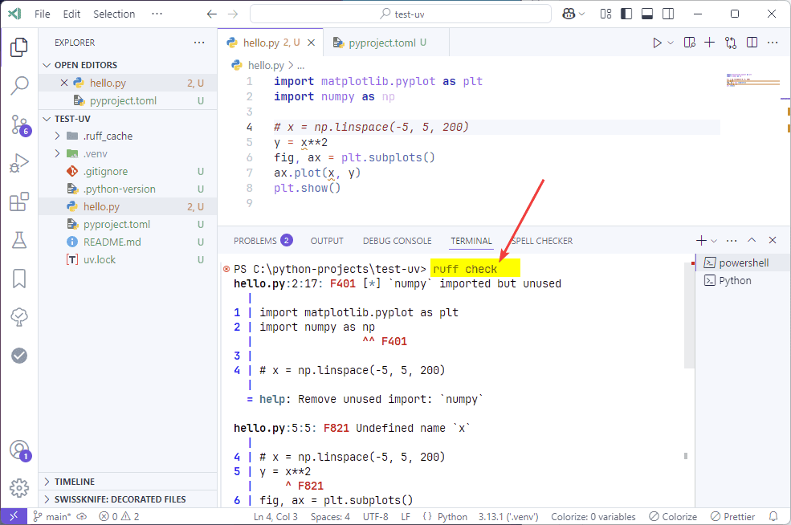

# Installing and Working with uv (Python) in VSCode


I will discuss uv as a replacement for pip, Poetry, PDM, and others, using Windows and VSCode as examples.

<details>
<summary>📖 Contents ⬇️</summary>

## Contents

- [In Brief](#in-brief)
- [Ссылки](#ссылки)
- [Preparation](#preparation)
- [Installing uv](#installing-uv)
- [Creating a project](#creating-a-project)
- [Creating a Virtual Environment](#creating-a-virtual-environment)
- [Writing and Running Code](#writing-and-running-code)
- [Adding Libraries](#adding-libraries)
- [Code Formatting](#code-formatting)
- [Additional Commands for uv](#additional-commands-for-uv)
- [Testing](#testing)
- [Deploying a Project on a New Machine](#deploying-a-project-on-a-new-machine)
- [Choosing a Different Python Version](#choosing-a-different-python-version)
- [Building an EXE File](#building-an-exe-file)
- [Creating Packages](#creating-packages)

</details>

Until very recently, I was advocating for Rye over pip, Pipenv, Hatch, Poetry, and PDM. But the author of Rye has handed over his project to the creators of uv and is advocating for the switch to uv.

However, the work is very much similar to working in Rye. It's no coincidence that these programs have merged. Although, as of now, not everything is as simple as in Rye: Ruff needs to be installed separately, there's no built-in test support, etc.

## In Brief

For instance, let's create a project `test-uv`.

- Install [uv](https://docs.astral.sh/uv/).
- `uv init test-uv` — create the `test-uv` project.
- Open the `test-uv` project folder in VSCode.
- `uv sync` — create a virtual environment.
- Select the created virtual environment in VSCode.
- Write code in `hello.py` and run it.
- To deploy the project on another machine, install uv and apply `uv sync`.

Commands for work:

- `uv init example` — create a folder `example` with uv project files.
- `uv init` — create a uv project in the current folder.
- `uv init --package example-pkg` — create a package project that will later be published.
- `uv add cowsay` — add a new library.
- `uv add --dev isort` — add a new library for development mode.
- `ruff format` — format Python files of the project (after `uv add --dev ruff`).
- `ruff check` — check Python files of the project.
- `uv self update` — update uv itself.
- `uv sync` — lock libraries and update virtual environment files according to `.lock` files.
- `uv sync --upgrade` — update all project libraries.
- `uv sync --upgrade-package cowsay` — update a specific library.
- `uv remove cowsay` — remove a library.
- `pytest` — runs tests based on `pytest` (after `uv add --dev pytest`).
- `uv python install 3.13` + `uv python pin 3.13` + `uv sync` — switch to another version of Python.
- `pyinstaller -F hello.py` — generates an EXE file (after `uv add --dev pyinstaller`).
- `uv build` — builds a library.
- `uv publish --token <pypi-token>` — publishes a library on PyPI.

## Ссылки

- [uv](https://docs.astral.sh/uv/) — the tool's website.
- [Creating packages in Python with uv](https://github.com/Harrix/harrix.dev-articles-2025-en/blob/main/create-python-package-uv/create-python-package-uv.md) | [↗️](https://harrix.dev/en/articles/2025/create-python-package-uv/).

## Preparation

<details>
<summary>Installation of programs and creating a folder for projects</summary>

Python is not mandatory since uv can install and manage Python by itself.

VSCode is required.

You need the Python extension in VSCode:


_Figure 1: Installing the Python extension_

Don't forget to switch to the file section:


_Figure 2: Explorer section_

Create a folder on your computer where the projects will be located, for example, `C:\python-projects`, if you don't already have a folder for Python projects (for example, using the command `mkdir C:\python_projects\` or simply via the file explorer). Open this folder via `File` → `Open Folder...` (you can also create the necessary folder through the folder opening window):


_Figure 3: Opening a folder_

You will be asked if you trust the authors of this folder. But didn't you just create this folder? So, we trust:


_Figure 4: Confirming folder access_

And enable the auto-save mode so you don't forget to save changes to the file:


_Figure 5: Auto Save mode_

</details>

## Installing uv

Go to the installation page <https://docs.astral.sh/uv/getting-started/installation/>. There, find the installation section for Windows. We are offered to install not via the standard EXE, but through PowerShell:


_Figure 6: Installation command for Windows_

Open Windows Terminal, PowerShell, or even VSCode (you will need a terminal there) and enter the command:

```shell
powershell -ExecutionPolicy ByPass -c "irm https://astral.sh/uv/install.ps1 | iex"
```


_Figure 7: Start of Installation_

After this, you are given the option to either reboot the computer or add the path to `uv` to the system variable `PATH` using a command:


_Figure 8: Prompt to Add Path to PATH_

I chose to add the path using a command and entered `$env:Path = "C:\Users\sergi\.local\bin;$env:Path"`, but you will have a different command since your username will be different!

Install Python, which will be managed using `uv` (the latest version will be installed):

```shell
uv python install
```


_Figure 9: Installing Python_

If you need a different version of Python, you can install it using a similar command: `uv python install 3.12`.

## Creating a project

Close VSCode and reopen it if you didn't close it during the installation of uv.

Open the terminal in VSCode using `Ctrl` → `` ` `` (`Ctrl` → `~`), and enter the command to create a new project (don't forget to press `Enter` after entering the command). Replace `test-uv` with the name of your project (do not use an underscore instead of a hyphen):

```shell
uv init test-uv
```


_Figure 10: Project Initialization_

By the way, you can initialize a project in any current folder in the terminal with the command `uv init`, and the current folder will become the project folder (I believe this wasn't available in Rye, and I like this feature).

As a result, a folder with all the necessary files appeared. Note that a complex project structure with a `src/test_uv` folder is not created, unlike in Rye, because according to uv, a complex structure is not needed for simple applications. The test file `hello.py` is created in the root of our project. To create a package, you would need to create the project with `uv init --package test-uv`.

You can use the command `cd test-uv` to navigate to the project folder. But it's better to directly open the newly created folder `C:/python-projects/test-uv` through `File` → `Open Folder...` and open the terminal with `Ctrl` → `` ` `` (`Ctrl` → `~`). From this point onward in the article, I will assume that the folder is open in VSCode:


_Figure 11: Opened project folder test-uv_

## Creating a Virtual Environment

Now you need to create a virtual environment using the command:

```shell
uv sync
```

The virtual environment folder will be created in the project folder:


_Figure 12: Created Virtual Environment_

In other systems, when working with a virtual environment, you need to ensure that the name of the virtual environment is displayed in parentheses in the terminal, which indicates that the virtual environment is activated:


_Figure 13: Display of Virtual Environment Name in Terminal_

In uv, this is not necessary, as it automatically ensures that scripts are run in the correct virtual environment. You can verify this by entering a command in the terminal:

```python
python -c "import sys; print(sys.prefix)"
```


_Figure 14: Path to the Current Virtual Environment_

It will be evident that the virtual environment of our project is being used.

However, VSCode still needs to be configured to automatically activate the appropriate virtual environment when it runs Python scripts. More on that in the next section. But as seen in the screenshot above, VSCode has detected the virtual environment, and you can agree to use it.

The main project settings are located in the `pyproject.toml` file, and there is also a lock file for the project's libraries, `uv.lock`.

## Writing and Running Code

Let's open the created `hello.py` file to test running a Python script (the second line is to check the activation of the correct virtual environment):

```python
print(2+2)

import sys; print(sys.prefix)
```

Let's verify that VSCode has correctly picked up the `.venv` virtual environment. To do this, look at the bottom right of the VSCode status bar. If a general virtual environment is displayed there (as shown in the figure), click on it and select our `.venv` environment:


_Figure 15: Selecting a Virtual Environment in VSCode_

Run the script using the run button at the top right:


_Figure 16: Running Python Code_

If you get the expected output, everything is working. Also, check that the path to the virtual environment is displayed correctly.

## Adding Libraries

Packages can be added using a command like:

```shell
uv add cowsay
```


_Figure 17: Adding a Library_

For example, in `main.py`, we can write the following code:

```python
import cowsay

cowsay.cow('Hello World')
```


_Figure 18: Running Code with Installed Library_

Let's also add the matplotlib library as an example:

```shell
uv add matplotlib
```

In `main.py`, write the following code:

```python
import matplotlib.pyplot as plt
import numpy as np

x = np.linspace(-5, 5, 200)
y = x ** 2

fig, ax = plt.subplots()
ax.plot(x, y)
plt.show()
```


_Figure 19: Displaying a Plot_

If you need libraries for development in your project, meaning they won't be needed by the user of your library when it's published, you should install them with the `--dev` parameter. For example, if you need to sort imports in your project using [isort](https://pypi.org/project/isort/), this library is needed for you as a developer but not for the users of your project. You can install it like this:

```shell
uv add --dev isort
```


_Figure 20: Installing isort Package_

## Code Formatting

Rye includes a library called [Ruff](https://pypi.org/project/ruff/) for code formatting. However, uv does not, even though this package is also their creation. So, you need to install it, and it can be used for all project files right away:

```shell
uv add --dev ruff
```

Then, you can use the library like this:

```shell
ruff format
```

The code was like this:

```python
import matplotlib.pyplot as plt
import    numpy as   np

x =    np.linspace( -5, 5,    200)
y = x**2
fig, ax =    plt.subplots()
ax.plot(x,    y)
plt.show()
```

And it became like this:

```python
import matplotlib.pyplot as plt
import numpy as np

x = np.linspace(-5, 5, 200)
y = x**2
fig, ax = plt.subplots()
ax.plot(x, y)
plt.show()
```


_Figure 21: Formatting Python Code_

To format code with a line length of 120 characters, you can insert the following lines into `pyproject.toml`, and then you can use `ruff format`:

```toml
[tool.ruff]
line-length = 120
```

_Figure 22 — Error Finding ruff_

## Additional Commands for uv

To update uv to the latest version, use the command:

```shell
uv self update
```


_Figure 22: Updating uv_

To lock libraries and update virtual environment files based on `.lock` files, use the `uv sync` command (you can also use `uv lock`):

```shell
uv sync
```

To update all libraries in the project, do the following:

```shell
uv sync --upgrade
```

If you need to update a specific library, such as `cowsay`, you can do it with the following command:

```shell
uv sync --upgrade-package cowsay
```

If a package is no longer needed, remove it like this:

```shell
uv remove cowsay
```


_Figure 23: Removing a Library_

To check your code for errors, you can use the linter with ruff, which we installed earlier (`uv add --dev ruff`):

```shell
ruff check
```



_Figure 24: Example of an Error Message_

## Testing

Since `pytest` was the default testing package in Rye, we'll also use it with uv:

```shell
uv add --dev pytest
```


_Figure 25: Installing pytest_

Now in the `hello.py` file (of course, you can rename this file or move it to the `src` folder), write some functions you want to test, for example:

```python
def multiply_2(x):
    return x * 2

def multiply_10(x):
    return x * 10

def multiply_20(x):
    return x * 20

def multiply_30(x):
    return x * 30
```

Create a `tests` folder in the root of your project:


_Figure 26: Creating the tests folder via right-click in explorer_

Inside it, create a file, for example, `test_hello.py`:


_Figure 27: Created file test_hello.py_

Note that the file should start with `test_`. So if you name the file, for example, `test.py`, `tests.py`, `testhello.py`, or `for_test.py`, `pytest` won't detect the tests (it can be configured, but it's better not to do so).

The `pytest` package needs to know where our main code is located. To do this, add the following configuration lines for `pytest` at the end of the `pyproject.toml` file:

```toml
[tool.pytest.ini_options]
pythonpath = "."
```

If your code is located in the `src` folder or any other folder, not in the root of the project as it is now, use similar settings (don't miss the space after the dot):

```toml
[tool.pytest.ini_options]
pythonpath = ". src"
```

Now in the `test_hello.py` file, we can write simple tests for our functions:

```python
from hello import *


def test_multiply_2():
    re = multiply_2(2)
    assert re == 4


def test_multiply_10():
    re = multiply_10(2)
    assert re == 20


def test_multiply_20():
    re = multiply_20(2)
    assert re == 40


def test_multiply_30():
    re = multiply_30(2)
    assert re == 60
```

If your `hello.py` file was located in the `src\test_uv\` folder, the first line would look like `from src.test_uv.hello import *`.

Test functions should also start with `test_`.

Now, in the terminal, run the command to execute the tests:

```shell
pytest
```

If everything is set up correctly, the tests should pass successfully:


_Figure 28: Successful Test Execution_

## Deploying a Project on a New Machine

Now let's assume you've successfully completed your project and want to run it on another machine. How do you proceed?

To deploy the project on another machine, install uv and use `uv sync`.

Transfer the `test-uv` project folder (or whatever it's named) to the other computer. For the example above, you need the following files from the original folder:


_Figure 29: Project Files_

Folders like `.pytest_cache`, `__pycache__`, `.ruff_cache`, `.venv` are not needed. They are specific to your local version of the project. If you use Git, thanks to the `.gitignore` file, unnecessary folders won't be included in the transferred folder.

On the computer, install uv and VSCode again, and open the `test-uv` folder in VSCode:


_Figure 30: Project Opened in VSCode_

Run the command to create a virtual environment with the same libraries that were in the project. This is specified in the `uv.lock` files:

```shell
uv sync
```


_Figure 31: Project Opened in VSCode_

Select the virtual environment from the `.venv` folder in VSCode (VSCode will likely prompt you to change the virtual environment automatically).

Now you can run the code. For example, I inserted the code above for testing `matplotlib`:


_Figure 32: Restored Project on Another Machine_

## Choosing a Different Python Version

First, download the desired Python version (for example, to check its operation on an older or newer Python):

```shell
uv python install 3.11
```


_Figure 33: Downloading a New Python Version_

If you're rolling back to an earlier Python version, don't forget to change the Python version to a lower one in `pyproject.toml`:


_Figure 34: Lowered Python Version_

Then, indicate that you want to switch to a different Python version. This command will change the `.python-version` file:

```shell
uv python pin 3.11.11
```

Then, recreate the virtual environment for the new Python version:

```shell
uv sync
```

That's it. Now a different Python version is displayed in VSCode. You can also check it through code:

```python
import sys
print(sys.version)
```


_Figure 35: Downloading a New Python Version_

To switch back to the old Python version, change it similarly, but without downloading the version:

```shell
uv python pin 3.13
uv sync
```

The same approach applies to updating the current Python version. For example, if you have Python 3.11.8, and version 3.11.9 is released. I didn't find a simple command, but you can do it using the same method:

```shell
uv python install 3.11.9
uv python pin 3.11.9
uv sync
```

To see the latest Python version you want to update to, visit [python.org](https://www.python.org/downloads/windows/) or [python-build-standalone](https://github.com/indygreg/python-build-standalone/releases).

## Building an EXE File

Let's try to build a console application with the following code:

```python
a = int(input())
b = int(input())
print(a + b)

input("Press enter to exit.")
```

For this, install the [pyinstaller](https://pyinstaller.org/en/stable/) package in `--dev` mode:

```shell
uv add --dev pyinstaller
```

After that, run pyinstaller:

```shell
pyinstaller -F hello.py
```

If the file was located in the `src\test_uv\` folder, the command would look like this:

```shell
pyinstaller -F src\test_uv\hello.py
```


_Figure 36: Generating an EXE File_

A `dist` folder will be created with the `main.exe` file.

Run it, enter numbers, and you'll see:


_Figure 37: Program Output Result_

The execution of EXE files was tested on a clean Windows 11.

If a single file is not needed, do not use the `-F` flag, and if you need a console application without a console (i.e., it should run in the background without creating a black terminal window), use the `--windowed` flag, for example, `pyinstaller -F --windowed hello.py`.

## Creating Packages

Read the separate article [Creating packages in Python with uv](https://github.com/Harrix/harrix.dev-articles-2025-en/blob/main/create-python-package-uv/create-python-package-uv.md) | [↗️](https://harrix.dev/en/articles/2025/create-python-package-uv/).
